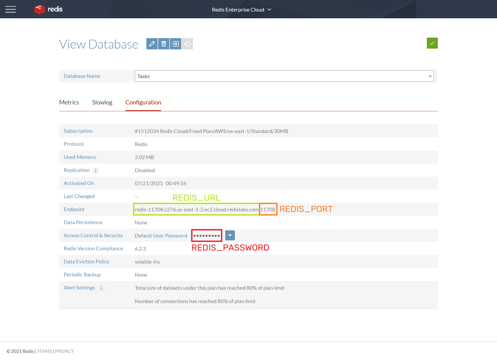

# E-Bid Form Web App
The E-bid Web Portal is a web application used for receiving, securing, transmitting, and storing documents issued by prospective suppliers and vendors for public bidding under Republic 
Act No. 9184, otherwise known as the Government Procurement Reform Act. The web application implements a **two-factor client-side encryption and decryption** to protect the confidentiality of government documents and prevent data breaches. Additionally, it operates an **asynchronous task queue system** to provide fast, convenient, and responsive task executions. It also supports **multiple media storage** to promote and sustain data redundancy.

# Installation Guide
This chapter describes the installation flow for the E-bid Web Portal platform in Windows as well as the several package dependencies and required services. It is assumed that you have already installed the latest version of Python as well as Git.

## Codebase Setup
* Clone this project
```
git clone https://github.com/kdpo/e-bid-form.git
```
* Go to the project directory
* Install, create, and activate a virtual environment
```
pip install virtualenv
virtualenv -p python3 venv
venv\Scripts\activate
```
* Install required python packages
```
pip install -r requirements.txt
```

## Configuration of Environment Variables
The environment variables below are located within the .env file. It is important to set up these values first before running the application.
* Configure the following, namely: ```SHAREPOINT_SITE```, ```SHAREPOINT_FOLDER_LOCATION```, ```SHAREPOINT_FOLDERNAME```, ```SHAREPOINT_USERNAME```, and ```SHAREPOINT_PASSWORD```. 
* Configure the following, namely: ```MINIO_ACCESS_KEY``` and ```MINIO_SECRET_KEY```, which are your username and password respectively. These are located within the .env file. By default, they are both configured to have ```‘minioadmin’``` as their values.
* This Gmail account will be used as the sender of the automated emails. Configure the following, namely: ```GMAIL_USERNAME``` and ```GMAIL_PASSWORD```. It is recommended to use **App Passwords** in accessing your Google Account.
* It is recommended to place your public key (.asc) within the **same level** as the .env file. Replace the value of ```PUBLIC_KEY``` with the file name of your key in the ```.env```.

## Running the Required Packages and Services

### Celery Task Workers
* Within the web application directory, run the following command in a terminal to run celery task workers (make sure that the virtual environment is activated)
```
celery -A tasks worker -l info -P threads
```

### MinIO Local Server
* Run the ```minio.exe``` which is found within the project directory in a separate terminal using the command below.
```
minio server <designated folder for bids>
```

### Redis Enterprise
Redis Enterprise can be utilized either as a software or as a hosted cloud service.

#### As a local software
* Replace the value of the environment variable, ```REDIS_DATABASE``` with the URL below.
```
REDIS_ENDPOINT = ‘redis://localhost:6379’
```
* In the project directory, locate and run ```redis-server.exe``` within ```Redis-x64-3.2.100``` folder
* Allow program access through Windows Firewall (if asked).

#### As a Hosted Cloud Service
* Register and login to your user account at https://app.redislabs.com
* Create a database and customize its settings.
* Select your created database to view its configurations. Refer to the image below in collecting the necessary information for setting up the connection to the cloud database.



* Configure the environment variable, namely ```REDIS_DATABASE``` found within the .env file. Strictly follow the format below.
```
REDIS_ENDPOINT = ‘redis://<REDIS_PASSWORD>@<REDIS_URL>:<REDIS_PORT>’
```
_**Remark**: Redis Enterprise Cloud offers free but limited services. File uploads will be limited up to 
~3 MB only. Free plans are designed for training purposes and prototyping. You must upgrade your 
subscription to maximize its features._

### Running the Application
* In a new separate command prompt window, run the following command.
```
python run.py
```
* Start your browser of choice and go to http://localhost:5000. Your web application should start with no issues once everything has been properly installed.
